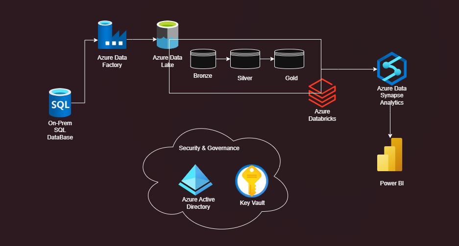
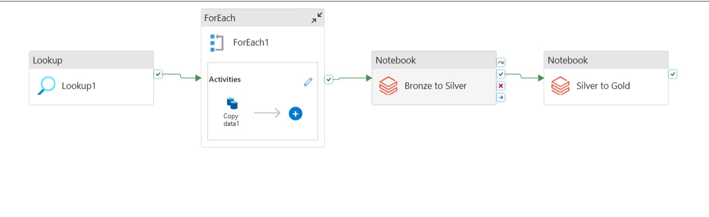
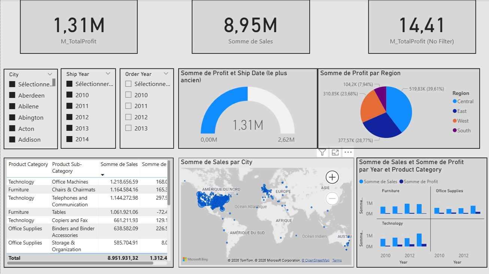

# Azure Data Engineering End-to-End Project 

This repository contains a complete **end-to-end data engineering pipeline** built on Microsoft Azure.  
It demonstrates how to ingest, transform, store, analyze, and visualize data from an on-prem SQL database to interactive dashboards using the modern Azure stack.

---

##  Project Overview

This project addresses a business analytics scenario by building a cloud data platform that:

1. Extracts data from **On-Prem SQL Server**  
2. Loads in **Azure Data Factory Storage (ADFS)**
3. stages it in **Azure Data Lake Storage (ADLS Gen2)**  
4. Transforms it using **Azure Databricks (PySpark)**  
5. Stores analytics-ready data in **Azure Synapse Analytics**  
6. Allows business insights via **Power BI dashboards**

---

## 🏗️ Architecture Diagram

Below is the high-level architecture illustrating key components and data flow:

**Explanation:**
- Azure Data Factory orchestrates pipelines
- Medallion architecture (Bronze → Silver → Gold)
- Databricks handles transformation workflows
- Synapse serves analytical data
- Power BI visualizes insights

---

## 🔄 Pipeline Flow

1. **Ingestion (ADF)**  
   Data is extracted from SQL Server and stored in the *Bronze* zone of ADLS.

2. **Transformation (Databricks)**  
   Data is cleaned and structured into *Silver*, then aggregated for analytics in *Gold*.

3. **Analytics (Synapse)**  
   Gold-level tables are loaded into Synapse for query performance and BI readiness.

4. **Visualization (Power BI)**  
   Synapse datasets are used to build dynamic business dashboards.

---

## Tech Stack

✔ Azure Data Factory – orchestrates ELT and schedules workflows  
✔ ADLS Gen2 – store raw/processed datasets  
✔ Azure Databricks – scalable Spark transformations  
✔ Azure Synapse Analytics – analytical data warehouse  
✔ Azure Key Vault & Azure AD – secure credentials & access  
✔ Power BI – interactive dashboards  
✔ SQL Server – source data system :contentReference[oaicite:1]{index=1}

---

## Dataset

This project uses the official Microsoft sample database:

- **AdventureWorks Sample Database**
  https://learn.microsoft.com/en-us/sql/samples/adventureworks-install-configure?view=sql-server-ver17&tabs=ssms

AdventureWorks is a transactional sample database provided by Microsoft that simulates a manufacturing company scenario.

---

## ADF Pipeline Example

Here is a snippet of the ADF pipeline demonstrating lookup + loop + notebook execution:

This pipeline uses:
- Lookup activity
- ForEach loop
- Copy and Databricks Notebook activities

---

## Power BI Dashboard Preview

Below is a screenshot of the final Power BI dashboard showing key business metrics:

The report highlights:
- Total Sales and Profit KPIs
- Sales distribution by region and year
- Interactive filters by city, year, category

---

## 📁 Project Structure

Azure-Data-Engineering-Project/
│
├── docs/
│ ├── architecture.png
│ ├── ADF_pipeline.png
│ └── powerbi_dashboard.png
│
├── data_ingestion/
│ ├── adf_pipelines/
│
├── data_transformation/
│ ├── databricks_notebooks/
│
├── SQL/
│ ├── queries/
│
├── visualization/
│ ├── powerbi/
│
├── README.md

---

## Setup Instructions

### Prerequisites

- Azure Subscription
- Power BI Desktop
- On-Prem SQL Server access

### Deployment Steps

1. **Create Azure Services:** ADLS, ADF, Databricks, Synapse, Key Vault  
2. **Configure ADF Pipelines** for ingestion and transformation  
3. **Deploy Databricks notebooks** (Bronze → Silver → Gold)  
4. **Load analytic tables** into Synapse SQL pools  
5. **Build and publish Power BI reports**

---

## Key Features

✔ Medallion architecture for structured data refinement  
✔ Automated ELT with parameterized ADF pipelines  
✔ Dynamic PySpark transformations in Databricks  
✔ Synapse Analytics for high-performance queries  
✔ Secure governance with Azure AD & Key Vault :contentReference[oaicite:2]{index=2}

---

##  Future Enhancements

- Real-time streaming ingestion (Event Hub / Kafka)  
- CI/CD with Azure DevOps or GitHub Actions  
- Data quality testing & monitoring  
- ML integration for predictive analytics

---

## 👤 Author

**Ayoub Bakkouri**  
Data Engineer | Analyst | BI

LinkedIn: Ayoub BAKKOURI
GitHub: ayoub-dev36
